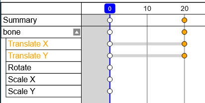

# {{ $frontmatter.title }}

:::tip
Small circles in the timeline represent keyframes.
:::

## Scroll / Zoom

Same as [main canvas](/mode/index.html#scroll).

## Select a keyframe

Click a keyframe to select it.

## Shift Select keyframes
You can also select keyframes continuously by holding `Shift` and click.  
If the targets have been selected already, `Shift + Click` will clear the selection.

## All Select keyframes

Press `a` to select all keyframes.  
If all keyframes have been selected already, pressing `a` will clear the selection.

## Delete Keyframes

Press `x` to delete selected keyframes.

## Grab

Press `g` to start the operation to grab keyframes.  
Then move the mouse to move their locations.

Finally, left-click to complete or right-click to cancel the operation.

## Duplicate

Press `D` to duplicate keyframes, and then enter `grab` operation automatically.
