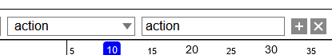
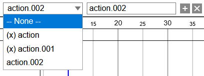

# {{ $frontmatter.title }}

## Create an action

Click `➕` button to create new action.  
The name of it can be changed from the input box beside it.

:::warning
The created action will be bound to the currently selected armature.  
So, if you do not select any armature, you cannot create new action.
:::

## Delete an action

Click `✖` button to delete current action.

## Select an action

If there are multiple actions, it is possible to select an action from the selection field.

:::tip
`(x)` means that current action is not bound to the current armature.
:::
