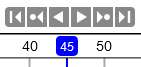
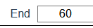

# {{ $frontmatter.title }}

## Animation Controllers

### Play Button

Play the animation.

### Pause Button

Pause the animation.

### Reverse Button

Play the animation backwords.

## Current Frame Controller

### Change Current Frame

Click or drag over the number labels at the top of the timeline to change current frame.

### Change End Frame

The end frame can be changed from the input field on the right side of the screen.

### Jump to Start Button

Go to the first frame.

### Jump to End Button

Go to the last frame.

### Jump to Next Button

Go to the frame with the next keyframe.

### Jump to Previous Button

Go to the frame with the previous keyframe.
