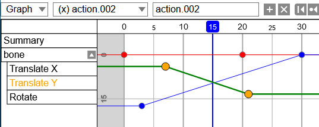
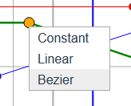
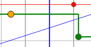
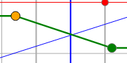
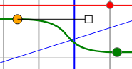
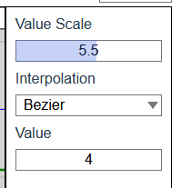

# {{ $frontmatter.title }}

## Select a keyframe

Click a keyframe to select it.

## Shift Select keyframes
Same as [action sheet](./action-sheet.md#shift-select-keyframes).

## All Select keyframes
Same as [action sheet](./action-sheet.md#all-select-keyframes).

## Delete Keyframes
Same as [action sheet](./action-sheet.md#delete-keyframes).

## Grab

Same as [action sheet](./action-sheet.md#duplicate).  
In addition, the value can be changed as y-axis.

:::tip
This operation is complatible with axis snapping and grid snapping.  
Press `x` or `y`, or holding `Ctrl` to do.
:::

## Duplicate
Same as [action sheet](./action-sheet.md#duplicate).

## Edit Curve

Press `t` to change curve types of selected keyframes.

### Constant

### Linear

This type is default when a keyframe is created.

### Bezier

Control points can be manipulated by dragging the square anchor.

## Side Panel

Selected keyframe's value and curve type can be edited in the panel on the right side of the timeline.

