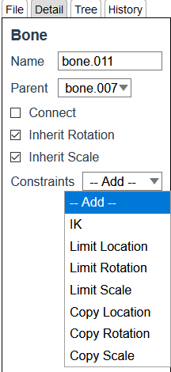
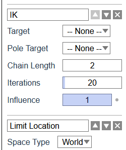
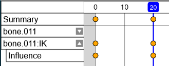

# {{ $frontmatter.title }}

Click `Detail` tab on the right side of the screen to display the detail panel.  

## Add Constraints

Select a constraint from the selection field.

## Common tools

### Change Name

The name can be changed from the input box.

### Swap Order

Click `△` or `▽` button to swap order of the constraint.

### Delete

Click `✖` button to delete the constraint.

## Common Properties

### Influence

Influence of constraints on the original deformation.

The keyframes of this property can be inserted.  
Click the dots at the right of the input field.

