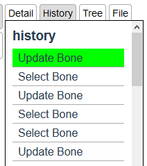

# {{ $frontmatter.title }}

:::tip
Use `Command` instead of `Ctrl` in Mac OS.
:::

## Undo

`Ctrl + z` will undo last operation.

## Redo

`Ctrl + Shift + z` will redo last undo operation.

## History Panel

Click `History` tab on the right side of the screen to display the history panel.  

### Max Limitation

Maximum limitation of the history stack is 64.  
And if you have more history, the oldest ones will disappear.

:::warning
History stack information is not saved and restored as a project.
:::
