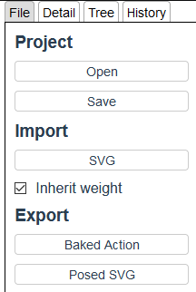
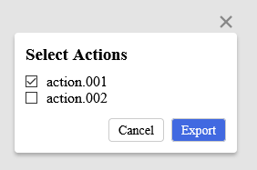

# {{ $frontmatter.title }}

Click `File` tab on the right side of the screen to display the file panel.  

## Project

### Open

Open the project file that you saved.

:::tip
`Ctrl + o` exec this operation.
:::

### Save

Save the project file.

:::tip
`Ctrl + s` exec this operation.  
If you are using chromium, it supports overwrite saving.
:::

## SVG

### Import

Import SVG elements from the file.

If you set `Inherit weight` true, current information of binding bones to elements are inherited by the loaded elements.

:::tip
This inheritance is based on the id of the element.
:::

### Export

Export current transformed elements as SVG file.

## Action

### Export Baked Actions

Export information about elements and actions baked as animation.  
Click `Baked Action` button to display the dialog and select the actions to be baked.  
Then, click `Export` button to export them.

:::warning
This button can't be clicked without selecting any armature.
:::

### Play on a Website

The exported data can be played on a website by using a client player.

This is the framework agnostic and lightweight player implementation.  
[blendic-svg-player](https://github.com/miyanokomiya/blendic-svg-player)
