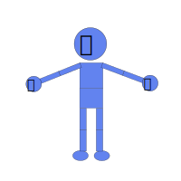

# {{ $frontmatter.title }}

## Blendic SVG

Blendic SVG is Free Software.  

Blendic SVG helps you make kinematic animation based on armatures, bones, constrains and keyframes like Blender. Bones and constrains, such as IK, make it easier to create complex character animations. Without these tools, your work would be  tough.  
Blendic SVG is also specialized to SVG, so you can attach kinematic animation to your original SVG and export it as SVG with CSS animation like here.  

If you are looking for SVG animation editor for character animation based on kinematics, Blendic SVG is the one what you are looking for. Let's enjoy our kinematic life.

[See overview](/overview)

## Edge version demo

https://miyanokomiya.github.io/blendic-svg/

## Documentation

https://github.com/miyanokomiya/blendic-svg-doc

## Player

https://github.com/miyanokomiya/blendic-svg-player

## License

Blendic SVG as a whole is licensed under the GNU Public License, Version 3. Individual files may have a different, but compatible license.

## Special thanks

Blendic SVG is greatly inspired by Blender, and respects Blender's license.  
See https://www.blender.org/about/license/ for details.
