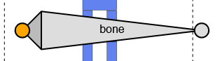
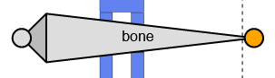
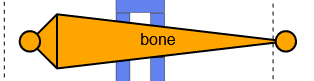
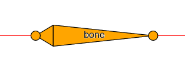
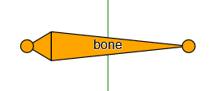
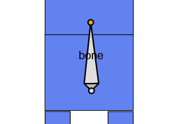
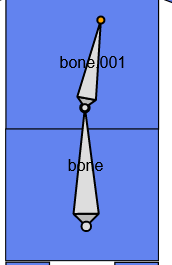

# {{ $frontmatter.title }}

## Select a bone

Click bone's head or tail to select it.

Click bone's body to select whole of it.

## Shift Select bones
You can also select bones continuously by holding `Shift` and click.  
If the targets have been selected already, `Shift + Click` will clear the selection.

## All Select bones

Press `a` to select all bones.  
If all bones have been selected already, pressing `a` will clear the selection.

## Add a Bone

Press `A` to add new bone.

## Delete Bones

Press `x` to delete selected bones.

::: tip
`Ctrl + z` will undo last operation.  
`Ctrl + Shift + z` will redo last undo operation.

Use `Command` instead of `Ctrl` in Mac OS.

[See mode](/history)
:::

## Grab

Press `g` to start the operation to grab bones.  
Then move the mouse to move their locations.

Finally, left-click to complete or right-click to cancel the operation.

::: tip
Most operations have a similar flow.  
Press some key to start, move the mouse to update and left-click to complete or right-click to cancel.
:::

## Rotate

Press `r` to start the operation to rotate bones.  
Then move the mouse to move their locations by rotating from the selected center.

Finally, left-click to complete or right-click to cancel the operation.

## Scale

Press `s` to start the operation to scale bones.  
Then move the mouse to move their locations by scaling up or down from the selected center.

Finally, left-click to complete or right-click to cancel the operation.

## Align with the Axis

Some operations are complatible with axis snapping.

Press `x` to align x-axis while moving the mouse.

Press `y` to align y-axis while moving the mouse.

## Grid Snapping

Some operations are complatible with grid snapping.

Hold `Ctrl` to snap some interval while moving the mouse.

## Extrude

Press `e` to extrude bones from selected heads and tails, and then enter `grab` operation automatically.

## Duplicate

Press `D` to duplicate bones, and then enter `grab` operation automatically.
