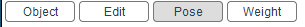
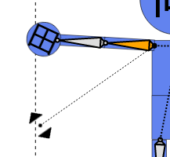

# {{ $frontmatter.title }}

## Select Mode

Select from the buttons in the upper left corner of the screen to change the mode.

Edit mode and pose mode can't be selected without selecting a armature.  
Weight paint mode can't be selected without importing SVG image.

:::tip
You can also chage a mode by pressing `Tab` or `Shift + Tab`.  
`Ctrl + tab` is not available because the browser's control takes precedence.
:::

## [Object Mode](./object)

## [Edit Mode](./edit)

## [Pose Mode](./pose)

## [Weight Paint Mode](./weight-paint)

