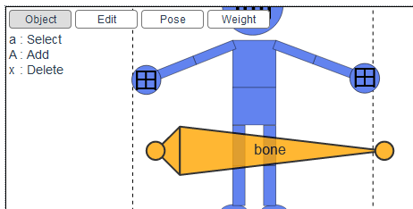

# {{ $frontmatter.title }}

## Select an Armature

Click a bone or press `a` to select the armature.

## Add an Armature

Press `A` to add new armature.

## Delete an Armature

Press `x` to delete selected armature.

::: tip
The feature of multi armatures does not make much sense now.
Therefore, you don't have to add or delete an armature and default one is good enough usually.
:::
