# {{ $frontmatter.title }}

## Select a bone

Click a bone to select the armature.  
In pose mode, you can't select the bone's head and tail separately.

## Shift Select bones
You can also select bones continuously by holding `Shift` and click.  
If the targets have been selected already, `Shift + Click` will clear the selection.

## All Select bones

Press `a` to select all bones.  
If all bones have been selected already, pressing `a` will clear the selection.

## Grab

Press `g` to start the operation to grab bones.  
Then move the mouse to update their locations.

Finally, left-click to complete or right-click to cancel the operation.

::: tip
Unlike the edit mode, you will edit the posing of the bones for each frame in this mode.
:::

## Rotate

Press `r` to start the operation to rotate bones.  
Then move the mouse to update their rotations from each head.

Finally, left-click to complete or right-click to cancel the operation.

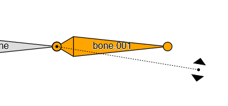
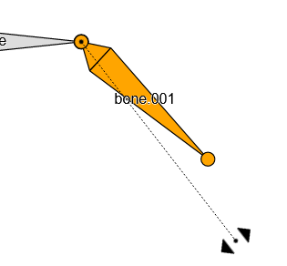

## Scale

Press `s` to start the operation to scale bones.  
Then move the mouse to update their scale.

Finally, left-click to complete or right-click to cancel the operation.

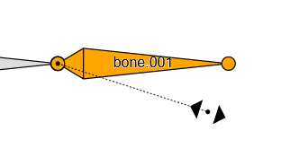
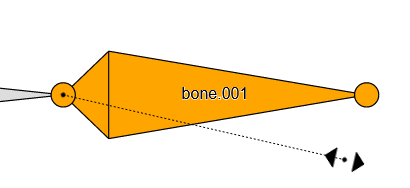

## Relationhsip

You can change the relationship between parent bone and child one.

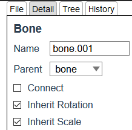

### Connect
If it is true, the bone's location is fixed the parent.  
If it is false, the bone can move relatively from the parent.

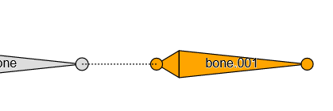
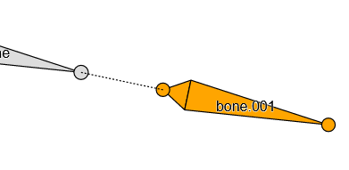

::: warning
Some operations in edit mode separate the parent's tail and the child's head. In this case, `Connect` property is set false automatically.
:::

### Inherit Rotation
If it is false, the bone's rotation are not affected by the parent's rotation.

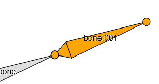
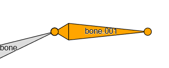

### Inherit Scale
If it is false, the bone's scale are not affected by the parent's scale.

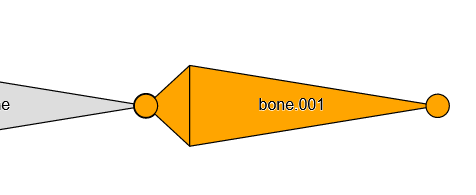
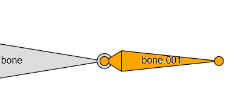

## Insert Keyframes

Press `i` to show the menu of insert keyframes.  
Selet an item to target keyframes.

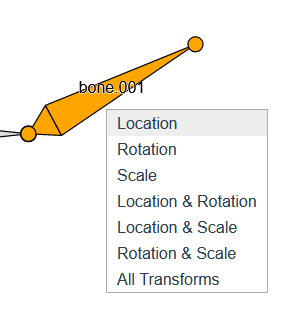

You can also insert keyframes from the item panel.  
Click the dots at the right of each input field.

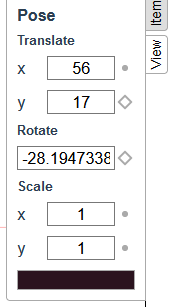

Inserted keyframes are displayed in the timeline at the bottom of the screen.

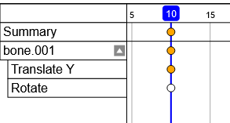

::: warning
Moving current frame without inserting keyframes will reset the editing pose.  
In this case, `Ctrl + z` may help you.
:::

