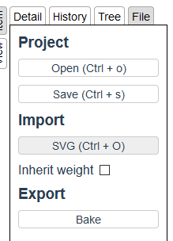
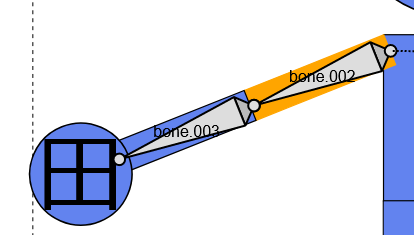
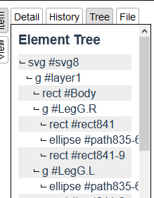
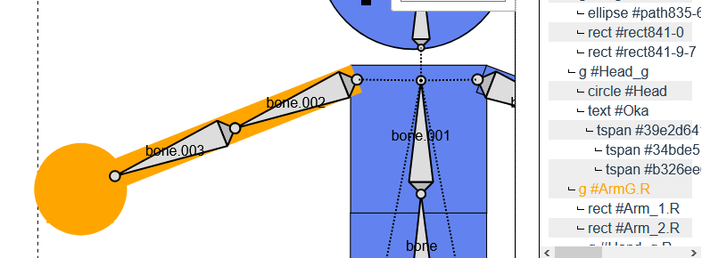
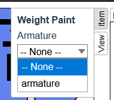
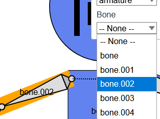
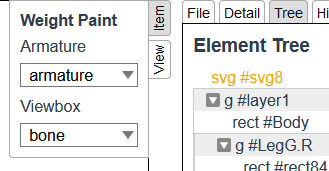
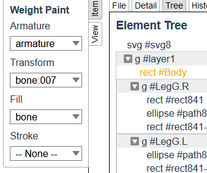

# {{ $frontmatter.title }}

## Import SVG

You need to import SVG file beforehand to start this mode.  

[See mode](/import-export/index.html#svg)

## Select an Element

Click an element to select it.

### Element Tree

You can also select elements from the tree.

Click `Tree` tab on the right side of the screen to display the tree panel.

Click tree node to select.  
If you want to select invisible elements, e.g. `<g>`, you have to select them in the tree.

## Bind Armature

Select an armature to bind to the entire SVG in the item panel.

## Bind Bone

Select a bone to bind to each bone in the item panel.

## Bind Bone to Viewbox

If you select root svg node, you can bind bone to it's `viewBox`.

## Bind Bone to Color

If you select elements that can have the attributes of `fill` and `stroke`, you can bind bone to the attributes.

:::tip
Colors are represented by HSVA.  
The transfomations of bound bone represent HSVA.
- rotate: H
- translate X: S
- translate Y: V
- scale X: A
:::
