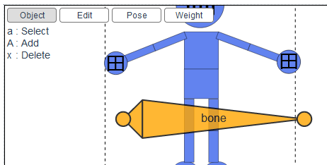
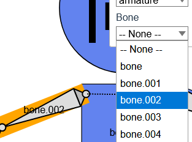

# {{ $frontmatter.title }}

## Import SVG

[See mode](/import-export/index.html#svg)

## Add Bones

Select a armature and change `Edit` mode.

Add and edit Bones.

[See mode](mode/edit)

## Weight Paint

Change `Weight` mode.

<!--  -->

Select SVG elements and bind to bones.

[See mode](mode/weight-paint)

## Pose

Change `Pose` mode.

Transform bones to transform bound SVG elements.

[See mode](mode/pose)

## Insert Keyframes

Insert keyframes to save the transformations of bones at the frame.

[See mode](mode/pose.html#insert-keyframes)

## Play Animation

The transformations between keyframes are interpolated automatically.

[See mode](animation/controller)

## Bake and Export

Export baked animations.

[See mode](/import-export/index.html#export-baked-actions)

## Play in a web page

[Client player is here](https://github.com/miyanokomiya/blendic-svg-player)

<!-- TODO [See mode](export) -->
